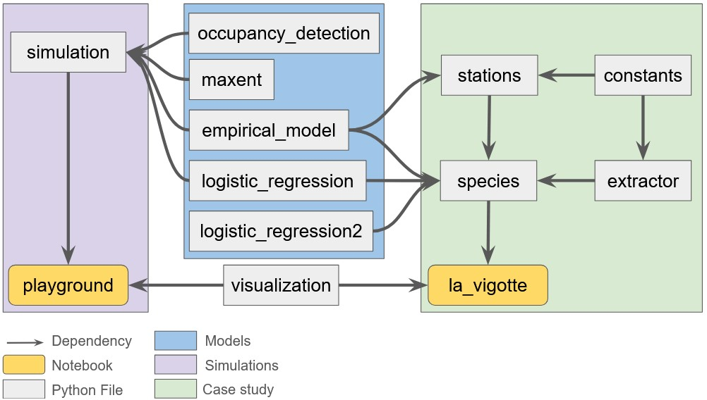

# Species Distribution Models

This project is part of a four-month research internship conducted at the French engineering school Mines Paris - PSL.
It aims to present general properties of standard Species Distribution Models (SDMs) through simulations and to provide object_oriented tools for ecological applications of SDMs.

## Installation

1️⃣ **Clone the repository in your terminal**:
```bash
git clone https:https://github.com/XavierMinesParis/SDM.git
cd SDM
```

2️⃣ **(Recommended) Create and activate a virtual environment**:
```bash
python -m venv env_sdm
```

On Linux/macOS:
```bash
source env_sdm/bin/activate
```

On Windows:
```bash
env_sdm\Scripts\activate
```

3️⃣ **Install dependencies**:
```bash
pip install -r requirements.txt
```

## Usage

You can run functions from your terminal or use the two example notebooks available in the repository:
- `playground.ipynb` explores general properties of SDMs through environmental simulations.
- `la_vigotte.ipynb` is a case study. Several presence-absence SDMs are tested on real data sampled at the French eco-hamlet of la Vigotte.

## Requirements

- Python >= 3.9
- Packages listed in `requirements.txt`

## Project Structure

```
SDM/
│
├── report/                     # Internship report
├── Data/                       # Folder for datasets
├── Figures/                    # Folder for plots
├── logistic_regression.py      # Classical logistic regression
├── logistic_regression2.py     # Logistic regression with L1 regularization
├── occupancy_detection.py      # Occupancy-detection model (McKenzie, 2002)
├── maxent.py                   # Maximum Entropy model (Phillips, 2006)
├── empirical_model.py          # Empirical model (Garbolino, 2014)
├── simulation.py               # Environmental simulation  (Lahoz-Monfort et al., 2013)
├── constants.py                # General imports and optional constant parameters for applications
├── extractor.py                # Extraction of climate data from locations
├── stations.py                 # Background climate data
├── species.py                  # Species object with climate data, models and their results
├── visualization.py            # Plotting utility functions
├── playground.py               # Example notebook for simulations
├── la_vigotte.py               # Example notebook for case studies
├── requirements.txt            # Dependencies
└── README.md                   # Project summary and instructions
```

## Code structure



## Contributing

Pull requests are welcome. Please open an issue first to discuss what you would like to change.

## License

This project is licensed under the MIT License, see the LICENSE.txt file for details.